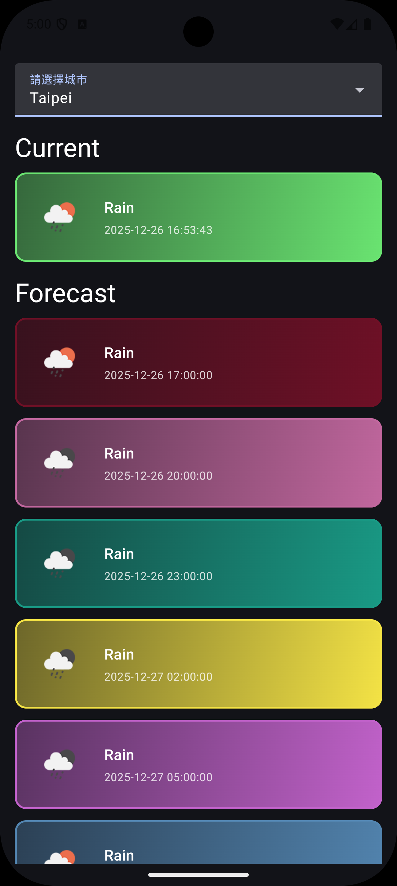
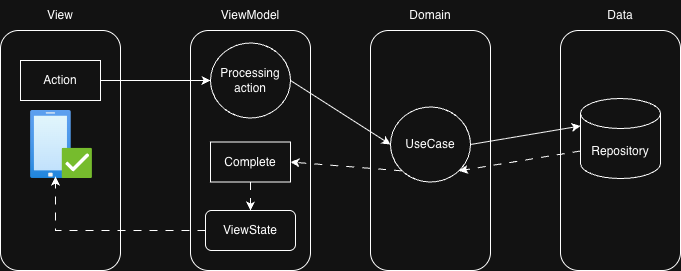

Weather Forecast App (天氣預報應用)
==================

這是一個簡易的天氣預報 Android 應用程式，旨在展示如何使用現代 Android 開發技術，建構一個乾淨、可擴展且具備良好使用者體驗的 App。使用者可以從下拉選單中選擇城市，來查看該城市當前和未來幾天的天氣資訊。

## ✨ 功能特色
* 城市選擇：提供下拉式選單，讓使用者可以輕鬆切換不同城市。
* 即時天氣：顯示所選城市當前的天氣狀況，包含天氣圖示和溫度等資訊。
* 天氣預報列表：以列表形式展示未來幾天的天氣預報。 
* 動態 UI：天氣項目卡片具有隨機的漸層色背景，提供豐富的視覺效果。 
* 暗色主題：預設啟用暗色模式，提供舒適的夜間瀏覽體驗。 
* 響應式狀態處理：清晰地處理載入中 (Loading)、資料載入完成 (Complete) 和錯誤 (Error) 等 UI 狀態。

## 🛠️ 使用的技術

這個專案使用了目前主流的 Android 開發技術和函式庫，以實現高效開發和高品質的應用程式。

* Kotlin：作為主要的開發語言。 
* Jetpack Compose：用於建構現代化、宣告式的原生使用者介面。 
* Coroutines：用於處理非同步任務，例如網路請求。 
* StateFlow：用於在 ViewModel 和 UI 之間傳遞和觀察狀態。 
* Hilt：用於依賴注入，簡化模組間的耦合。 
* Retrofit：用於處理 RESTful API 網路請求。 
* OkHttp：作為 Retrofit 的底層 HTTP 客戶端。 
* Coil：一個高效的圖片載入函式庫，用於從網路載入天氣圖示。 
* Material 3：遵循 Google 最新的設計語言，提供美觀且一致的 UI 元件。 
* ViewModel：屬於 Jetpack 架構元件，用於儲存和管理與 UI 相關的資料。

## 🏗️ 軟體架構

主架構遵循 Clean Architecture (乾淨架構) 的設計原則，將應用程式劃分為三個主要層次：Presentation、Domain 和 Data。 這種分層架構強制執行關注點分離 (Separation of Concerns) 和依賴倒置原則 (Dependency Inversion Principle)，使得架構的中心（Domain 層）不依賴於任何外部實現細節。

### 各層職責

1.Presentation Layer (表現層)

    * 職責：負責所有與 UI 相關的邏輯。 
    * 元件：
        * View (UI)：由 MainActivity 和一系列 Jetpack Compose 函式組成，負責渲染畫面並捕捉使用者輸入。
        * ViewModel (MainViewModel)：持有並管理 UI 狀態 (StateFlow)，並呼叫 Domain 層的 Use Case 來執行業務邏輯。它將 Use Case 回傳的資料模型轉換為 UI 可以直接使用的狀態。

2.Domain Layer (領域層)

    * 職責：包含應用程式最核心的業務規則和邏輯，是整個架構中最獨立、最穩定的部分。
    * 特性：這是一個純 Kotlin 模組，不包含任何 Android 框架的依賴 (import android.*)。
    * 元件：
        * Use Case (GetTwCityListUseCase, GetWeatherForecastUseCase)：封裝了單一且特定的業務操作。它們是 ViewModel 和 Repository 之間的橋樑。
        * Entities (WeatherForecastUI, WeatherUI)：定義了核心的業務物件。

3.Data Layer (資料層)

    * 職責：負責提供 Domain 層所需要的資料。它知道資料從哪裡來（網路、資料庫、快取等），但 Domain 層對此一無所知。
    * 元件：
        * Repository (WeatherRepository)：實現從OpenWeather API來獲取天氣資訊與預測。

透過 Hilt 進行依賴注入，我們可以在 Presentation 層輕鬆地注入 ViewModel，並在 ViewModel 中注入 Use Case，同時將 Repository 的實現綁定到其接口上，實現了層與層之間的解耦。

### Unidirectional Data Flow

這種單向資料流的架構使得資料的流動變得可預測且易於除錯。UI 的更新總是來自於一個單一的信任來源 (ViewModel 的 StateFlow)，避免了狀態不一致的問題。

## 使用AI的地方

此專案中以下部分，使用Gemini來協助開發

* 建構Network及Hilt環境
* UI編排的調整，例如：
  * prompt: @MainActivity.kt 我要的是Compose UI的排版：1. CityDropdownMenu、CurrentWeather、ForecastList裡的元件都跟手機等寬, 左右各留16.dp
  * prompt: @MainActivity.kt 讓WeatherItem有框和隨機顏色，是漸層的，從左上淡到右下深
* 產生README.md
  * prompt: 幫我這專案建立README.md，列出基本介紹、使用的技術、軟體架構